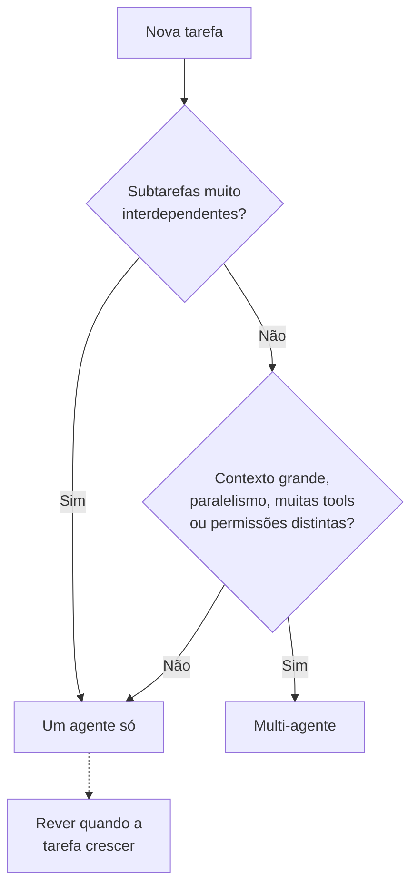
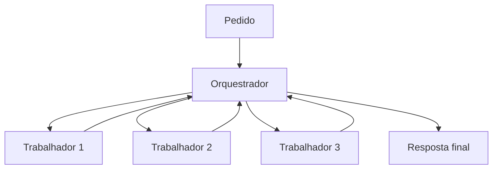
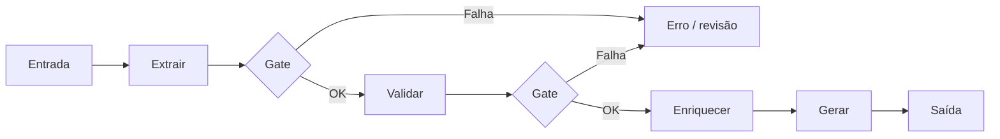
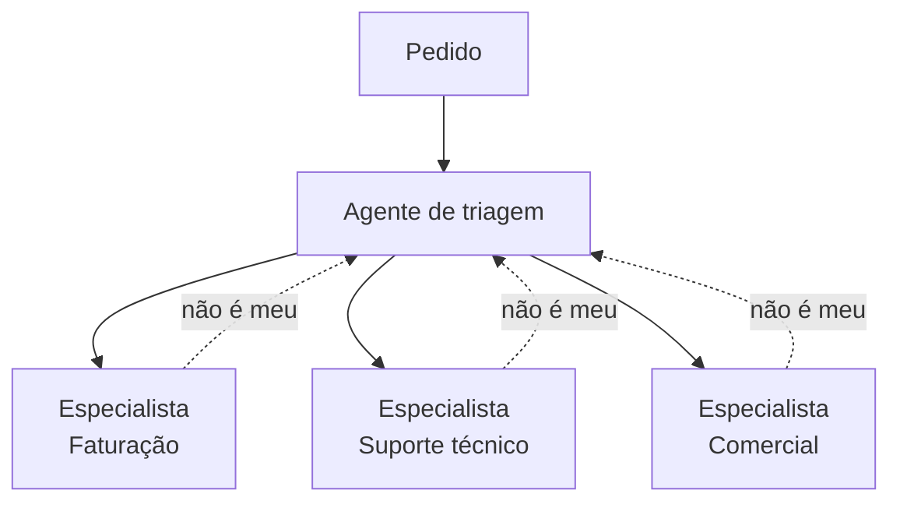
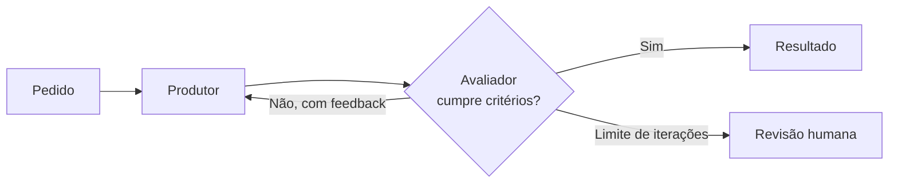
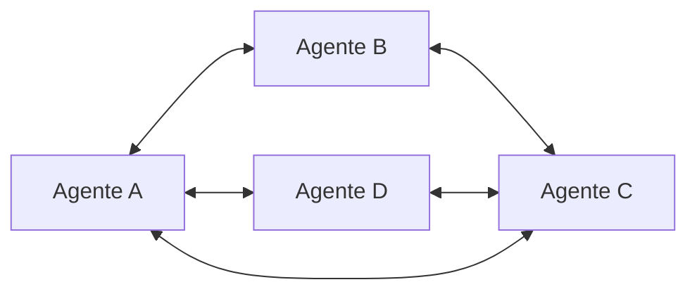
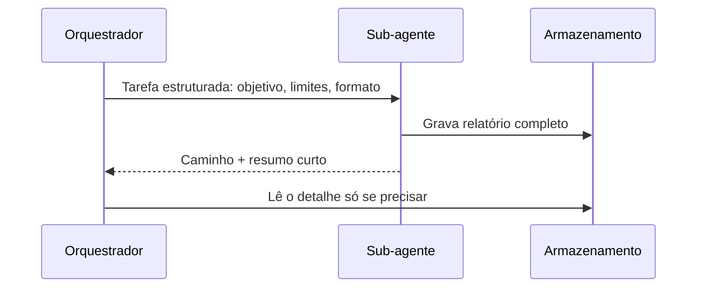
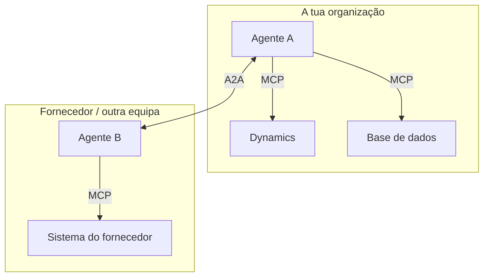
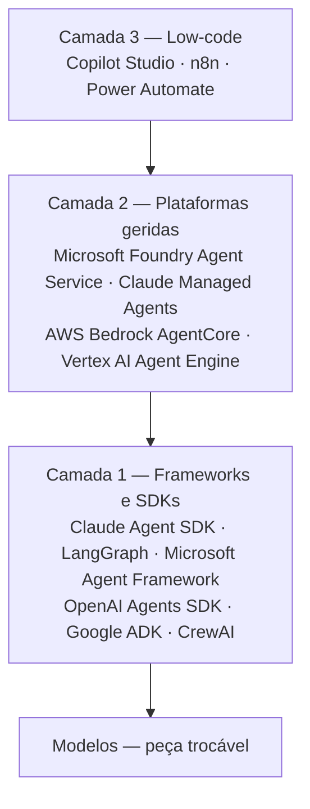

# Parte 2 — Arquitetura Multi-Agente

> Workshop: Arquitetura AI em Ambiente Enterprise. Parte 2 de 4.
> Anterior: [Parte 1 — Conceitos base e anatomia de um agente](01-conceitos-e-anatomia-agente.md)

**Última atualização:** 2026-10-01

---

## Índice

1. [Quando vale a pena ter vários agentes](#1-quando-vale-a-pena-ter-vários-agentes)
2. [Padrões de arquitetura](#2-padrões-de-arquitetura)
3. [Comunicação entre agentes](#3-comunicação-entre-agentes)
4. [Orquestração na prática: frameworks e plataformas](#4-orquestração-na-prática-frameworks-e-plataformas)

---

## 1. Quando vale a pena ter vários agentes

**Regra de partida: começar com um agente só** e dividir apenas quando houver uma razão concreta. Multi-agente traz custos reais: mais tokens (pode gastar várias vezes mais do que um agente único), mais latência, mais pontos de falha e depuração muito mais difícil.

**Quatro razões legítimas para dividir:**

1. **O contexto não cabe ou degrada-se** — sub-agentes trabalham em contexto limpo e devolvem só um resumo.
2. **Paralelismo** — subtarefas independentes (ex.: analisar dez contratos) terminam muito mais depressa em paralelo.
3. **Especialização** — um agente com 30 ferramentas escolhe pior do que três agentes com 10 cada.
4. **Fronteiras de segurança e governação** — separar quem lê dados sensíveis de quem escreve em sistemas externos aplica o princípio do menor privilégio.

**Sinal de que não vale a pena:** subtarefas muito interdependentes, que precisam de partilhar contexto constantemente. Perde-se detalhe em cada passagem.

| Situação | Multi-agente? | Porquê |
|---|---|---|
| Contexto grande ou que degrada | ✅ Sim | Cada sub-agente com contexto limpo, devolve resumo |
| Subtarefas independentes | ✅ Sim | Paralelismo, menor tempo total |
| Demasiadas ferramentas | ✅ Sim | Especialização melhora a escolha |
| Permissões diferentes por tarefa | ✅ Sim | Menor privilégio, isolamento |
| Subtarefas muito interdependentes | ❌ Não | Perda de contexto nas passagens |
| Tarefa simples ou sequencial | ❌ Não | Custo e complexidade sem ganho |
| Na dúvida | ❌ Não | Começar com um agente e dividir depois |

---

## 2. Padrões de arquitetura

### 2.1 Orquestrador-trabalhadores (orchestrator-workers)

Um agente central recebe o pedido, decide em tempo real como o dividir, lança sub-agentes em paralelo e junta os resultados. Os trabalhadores só falam com o orquestrador.

- **Quando usar:** tarefas abertas, subtarefas desconhecidas à partida (pesquisa, análise de vários documentos, due diligence de fornecedores).
- **Risco:** má decomposição ou instruções vagas. Cada sub-agente deve receber objetivo, formato de resposta e limites.

### 2.2 Pipeline sequencial (prompt chaining)

Cada agente faz uma etapa e passa o resultado ao seguinte, com verificações por código (*gates*) entre etapas. É um workflow: o padrão mais previsível e auditável.

- **Quando usar:** processos estáveis e conhecidos (faturas, onboarding, relatórios).
- **Risco:** rigidez e propagação de erros — daí os gates.

### 2.3 Hand-off / encaminhamento (routing)

Um agente de triagem classifica o pedido e passa-o ao especialista certo, que assume a conversa.

- **Quando usar:** entradas de categorias distintas que exigem ferramentas, prompts ou permissões diferentes.
- **Risco:** perda de contexto e classificação errada. A passagem leva um resumo estruturado; o especialista pode devolver o pedido.

### 2.4 Avaliador-otimizador (evaluator-optimizer)

Um agente produz, outro avalia segundo critérios explícitos e devolve feedback; repete até cumprir os critérios ou atingir o limite de iterações.

- **Quando usar:** critérios de qualidade claros e a iteração melhora mesmo o resultado (propostas, código, traduções, documentos regulatórios).
- **Risco:** ciclos infinitos, custo e avaliador benevolente. Usar prompt diferente, critérios objetivos e, se possível, verificações por código.

### 2.5 Rede / malha (network / swarm)

Os agentes comunicam diretamente entre si, sem coordenador central.

- **Quando usar:** muito raramente em enterprise; investigação e simulação.
- **Risco:** imprevisível, difícil de depurar e auditar. Praticamente desaconselhado em ambientes regulados.

> **Os padrões combinam-se.** Ex.: routing à entrada → pipeline no especialista de faturação → avaliador-otimizador antes de responder ao cliente.

### Matriz dos padrões

| Padrão | Como funciona | Quando usar | Risco principal | Previsibilidade |
|---|---|---|---|---|
| Orquestrador-trabalhadores | Central decompõe, lança sub-agentes em paralelo e junta | Tarefas abertas, subtarefas desconhecidas | Má decomposição, instruções vagas | Média |
| Pipeline sequencial | Etapas fixas em cadeia, com gates | Processos estáveis e conhecidos | Rigidez, erros propagam-se | Alta |
| Hand-off / routing | Triagem encaminha para o especialista | Pedidos de categorias distintas | Perda de contexto, má classificação | Alta |
| Avaliador-otimizador | Produtor e avaliador iteram até cumprir critérios | Critérios de qualidade claros | Ciclos infinitos, avaliador benevolente | Média |
| Rede / malha | Agentes falam diretamente entre si | Investigação, simulação | Imprevisível, difícil de auditar | Baixa |

---

## 3. Comunicação entre agentes

A qualidade de um sistema multi-agente depende mais de **como a informação passa** entre agentes do que de cada agente individual.

### 3.1 Três formas de passar contexto

- **Mensagens** — um agente envia ao outro o que precisa. Cada passagem é uma compressão (efeito "telefone estragado"). Estruturar sempre: objetivo, o que se sabe, o que falta, restrições, formato da resposta.
- **Estado partilhado (quadro negro)** — repositório comum lido e escrito por todos. Exige regras claras de quem escreve o quê.
- **Artefactos por referência** — o sub-agente grava o resultado num armazenamento e devolve só o caminho + resumo curto. **Padrão recomendado para resultados grandes.**

### 3.2 Protocolos: MCP e A2A

São **complementares**, não concorrentes.

- **MCP** — **vertical**: liga um agente às suas ferramentas e dados. A ferramenta é opaca e obediente.
- **A2A (Agent-to-Agent)** — protocolo aberto lançado pela Google, hoje com governança aberta. **Horizontal**: liga agentes a agentes, entre fornecedores e frameworks. O outro agente é autónomo: decide como cumprir, pode demorar e pedir esclarecimentos.
  - **Agent Card** — cartão de visita: capacidades, endereço, autenticação.
  - **Task** — unidade de trabalho com ciclo de vida (submetida → em curso → à espera de input → concluída / falhada).
  - **Artifacts** — resultados produzidos.
- **Chamadas diretas** — dentro do próprio sistema não é preciso protocolo. O A2A ganha sentido ao atravessar fronteiras (fornecedores, outras equipas, plataformas SaaS).

### 3.3 Preocupações enterprise

- **Identidade** — cada agente com identidade própria; delegação explícita (OAuth, tokens com âmbito limitado). Nunca mais permissões do que o utilizador que o invocou.
- **Fronteiras de confiança** — o output de um agente é input não confiável para o seguinte. Uma injeção de prompt pode propagar-se em cadeia; cada passagem é dados, nunca ordens.
- **Rastreabilidade** — um ID de correlação atravessa todos os agentes envolvidos, para tracing de ponta a ponta.

### Matriz da comunicação

| Tema | Opção | Como funciona | Ponto-chave |
|---|---|---|---|
| Passagem de contexto | Mensagens | Agente envia ao outro o que precisa | Estruturar: objetivo, contexto, restrições, formato |
| | Estado partilhado | Repositório comum lido e escrito por todos | Regras claras de quem escreve o quê |
| | Artefactos por referência | Grava o resultado, passa caminho + resumo | Padrão para resultados grandes |
| Protocolos | MCP | Vertical: agente ↔ ferramentas e dados | Ferramenta obedece, é opaca |
| | A2A | Horizontal: agente ↔ agente, entre fornecedores | Agent Card, Task, Artifacts; o outro agente é autónomo |
| | Chamadas diretas | Dentro do próprio sistema | Sem protocolo quando não se atravessam fronteiras |
| Enterprise | Identidade | Identidade própria por agente, delegação OAuth | Nunca mais permissões que o utilizador |
| | Fronteiras de confiança | Output de um agente é input não confiável | Travar a propagação de injeções de prompt |
| | Rastreabilidade | ID de correlação em todos os agentes | Tracing de ponta a ponta |

---

## 4. Orquestração na prática: frameworks e plataformas

O mercado arrumou-se em três camadas. Primeiro decide-se a camada, depois a ferramenta.

### 4.1 Camada 1 — Frameworks e SDKs (controlo total, em código)

- **Claude Agent SDK** — o ciclo de agente, ferramentas e gestão de contexto do Claude Code como biblioteca (Python e TypeScript). Ferramentas incorporadas, hooks, sub-agentes, MCP, permissões e sessões.
- **LangGraph** — agente como grafo de estados. Versão 1.0 em outubro de 2025. Referência em execução durável e human-in-the-loop (parar, esperar dias por aprovação, retomar). Agnóstico de modelo.
- **Microsoft Agent Framework** — GA na versão 1.0 a 3 de abril de 2026 (.NET e Python). Une as bases enterprise do Semantic Kernel com as orquestrações do AutoGen. Semantic Kernel continua suportado, mas o trabalho novo vai para o Agent Framework.
- **Outros** — OpenAI Agents SDK, Google ADK, CrewAI (popular em protótipos multi-agente por papéis).

### 4.2 Camada 2 — Plataformas geridas (o fornecedor corre o agente)

- **Microsoft Foundry** (antigo Azure AI Foundry) — Foundry Agent Service: runtime alojado independente de framework com sandbox por sessão; A2A de saída disponível e de entrada em pré-visualização; agentes de longa duração; tracing OpenTelemetry; publicação em Teams e Microsoft 365 Copilot; identidade via Entra Agent ID (anúncios Build 2026).
- **Claude Managed Agents** — ciclo do agente alojado pela Anthropic, com sandbox gerida ou alojada na própria infraestrutura.
- **AWS Bedrock AgentCore**, **Google Vertex AI Agent Engine** — integração nativa nas respetivas clouds.

### 4.3 Camada 3 — Low-code

Copilot Studio, n8n, Power Automate. Rápidos para casos simples e equipas de negócio; limitados com lógica complexa ou testes rigorosos.

### 4.4 Como escolher

1. **Ecossistema** — onde vivem a identidade, os dados e a segurança do cliente.
2. **Controlo vs. velocidade** — código dá controlo e testabilidade; plataforma dá velocidade e operação.
3. **Portabilidade** — frameworks agnósticos e protocolos abertos (MCP, A2A) reduzem lock-in.
4. **Governação** — identidade de agente, tracing e auditoria nativos poupam meses.

> **Contexto Dynamics / Azure:** Microsoft Agent Framework ou LangGraph para o código, Foundry Agent Service para correr e governar, MCP para expor o Dynamics como ferramenta reutilizável. Modelo sempre como peça trocável.

### Matriz de frameworks e plataformas

| Camada | Opção | Ponto forte | Quando escolher |
|---|---|---|---|
| Framework / SDK | Claude Agent SDK | Ciclo do Claude Code como biblioteca; MCP, sub-agentes, hooks, permissões | Agentes sobre ficheiros, código e sistemas; foco em Claude |
| | LangGraph | Grafo de estados, execução durável, human-in-the-loop | Fluxos complexos com controlo fino; agnóstico de modelo |
| | Microsoft Agent Framework | Sucessor de Semantic Kernel + AutoGen; GA abr. 2026 | Projetos novos no ecossistema Microsoft |
| | OpenAI Agents SDK, Google ADK, CrewAI | Alternativas por ecossistema; CrewAI rápido a prototipar | Conforme fornecedor ou fase de protótipo |
| Plataforma gerida | Microsoft Foundry Agent Service | Runtime agnóstico, A2A, OpenTelemetry, Teams/M365, Entra Agent ID | Clientes Azure / Microsoft 365 |
| | Claude Managed Agents | Ciclo alojado; sandbox gerida ou própria | Agentes Claude sem operar infraestrutura |
| | AWS Bedrock AgentCore, Vertex AI Agent Engine | Integração nativa na respetiva cloud | Clientes AWS ou Google Cloud |
| Low-code | Copilot Studio, n8n, Power Automate | Velocidade, equipas de negócio | Casos simples; não para lógica complexa |

### Fontes

- [Microsoft Semantic Kernel Explained (Atlan)](https://atlan.com/know/ai-agent/microsoft/semantic-kernel/)
- [Foundry Agent Service at Build 2026 (Microsoft)](https://devblogs.microsoft.com/foundry/agent-service-build2026/)
- [Agent SDK overview (Claude Code docs)](https://code.claude.com/docs/en/agent-sdk/overview)
- [LangGraph 1.0 released in October 2025 (Medium)](https://medium.com/@romerorico.hugo/langgraph-1-0-released-no-breaking-changes-all-the-hard-won-lessons-8939d500ca7c)

---

**Próxima parte:** [Governança e segurança em enterprise](03-governanca-e-seguranca.md).
