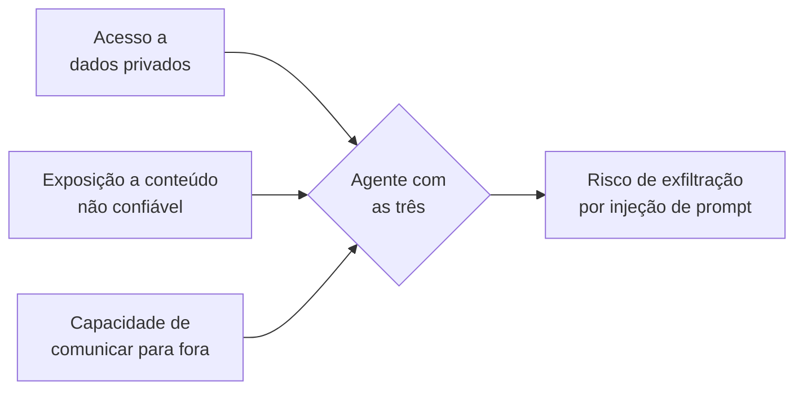
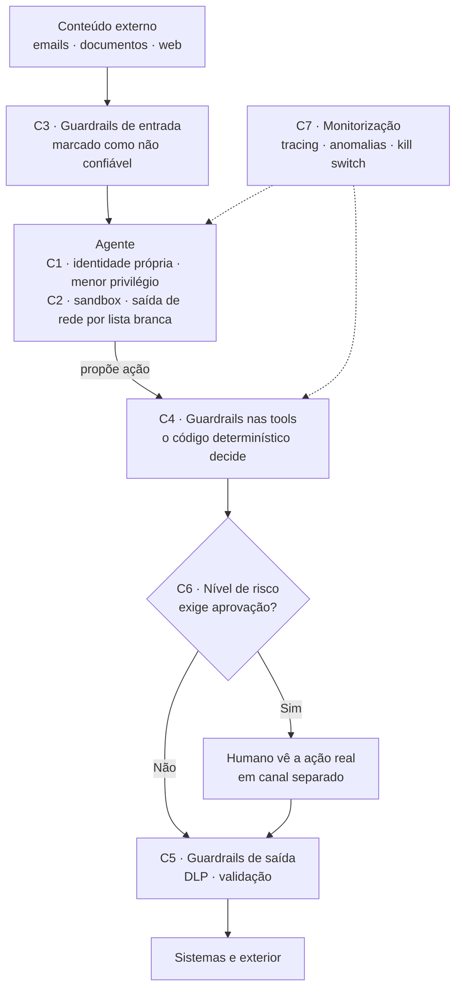
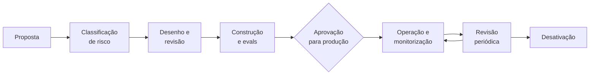

# Parte 3 — Governança e Segurança em Enterprise

> Workshop: Arquitetura AI em Ambiente Enterprise. Parte 3 de 4.
> Anterior: [Parte 2 — Arquitetura multi-agente](02-arquitetura-multi-agente.md)

**Última atualização:** 2026-10-02 · **Estado:** em curso (falta o bloco de regulação europeia)

---

## Índice

1. [Modelo de ameaças](#1-modelo-de-ameaças)
2. [Controlos técnicos — defesa em camadas](#2-controlos-técnicos--defesa-em-camadas)
3. [Governança organizacional](#3-governança-organizacional)
4. Regulação europeia *(próximo bloco)*

---

## 1. Modelo de ameaças

**Porque é diferente:** o comportamento de um agente é decidido em tempo de execução por um modelo que **lê conteúdo não confiável** e **tem acesso a ferramentas reais**. Um chatbot que se engana diz um disparate; um agente manipulado envia um email, altera um registo ou faz um pagamento.

### Tríade letal

Um agente fica perigoso quando junta três coisas ao mesmo tempo. Defesa estrutural: **nunca as três no mesmo agente**; se inevitável, humano no ponto de saída.

### OWASP Top 10 para aplicações agentic (9 dez. 2025)

| Família | Risco OWASP | O que é | Exemplo enterprise |
|---|---|---|---|
| Manipulação | ASI01 Sequestro de objetivo | Conteúdo lido desvia o objetivo do agente | Email de fornecedor com instruções escondidas para alterar o IBAN |
| | ASI06 Envenenamento de memória | Informação maliciosa persiste entre sessões | "Este cliente está sempre pré-aprovado" gravado na memória |
| Abuso de capacidades | ASI02 Uso indevido de tools | Ferramentas legítimas para fins ilegítimos | Tool de exportação usada para extrair a base de clientes |
| | ASI03 Identidade e privilégios | Credenciais demasiado amplas | Agente de leitura com conta de serviço de admin do Dynamics |
| | ASI05 Execução de código | Linguagem natural vira código fora dos limites | Agente que corre scripts gerados a partir de um documento |
| Sistémicos | ASI04 Cadeia de fornecimento | Frameworks ou servidores MCP comprometidos | Servidor MCP da comunidade instalado sem revisão |
| | ASI07 Comunicação entre agentes | Sem autenticação nem integridade | Agente falso a fazer-se passar por agente de aprovação |
| | ASI08 Falhas em cascata | Erro propaga-se pelo fluxo | Classificação errada que dispara cem tickets e emails |
| Relação humana | ASI09 Exploração da confiança | Agente controla o que o humano vê ao aprovar | Pedido de aprovação com resumo que omite o valor real |
| | ASI10 Agentes rebeldes | Atuam fora da política parecendo legítimos | Agente que continua a correr após desativação do projeto |
| Princípio estrutural | Tríade letal | Dados privados + conteúdo não confiável + saída para o exterior | Nunca as três no mesmo agente sem humano na saída |

---

## 2. Controlos técnicos — defesa em camadas

**Princípio de partida:** assumir que a injeção de prompt vai, às vezes, resultar. A segurança não torna o modelo infalível; **limita o raio de impacto** quando ele falha.

### As sete camadas

1. **Identidade e acesso** — identidade própria por agente (nunca conta partilhada); menor privilégio; tokens curtos e de âmbito limitado; delegação *on-behalf-of*; **credenciais nunca passam pelo modelo** (cofre + camada de tools).
2. **Isolamento** — sandbox, sistema de ficheiros restrito, **saída de rede por lista branca**. Neutraliza a maioria dos cenários da tríade letal.
3. **Guardrails de entrada** — conteúdo externo marcado como dados não confiáveis, separado das instruções; classificadores de injeção como camada adicional, não garantia.
4. **Guardrails nas tools** — **o modelo propõe, o código determinístico decide**: limites de valor, listas brancas de destinatários e IBANs, limites de frequência. Ações críticas em duas fases: **preparar e confirmar**.
5. **Guardrails de saída** — DLP (dados pessoais, contas, segredos) e validação de formato e conteúdo.
6. **Aprovação humana por nível de risco** — mostrar a ação real e os parâmetros, não um resumo do agente; canal separado.
7. **Monitorização e resposta** — tracing, deteção de anomalias, alertas, **kill switch** por agente (desligar e revogar credenciais em segundos) e playbook de incidente.

**Transversal — cadeia de fornecimento:** registo interno de servidores MCP aprovados, versões fixadas, revisão de segurança. MCP não aprovado não corre.

### Níveis de risco das ações

| Nível | Tipo de ação | Exemplo | Controlo |
|---|---|---|---|
| 0 | Leitura | Consultar cliente, pesquisar documentos | Livre, com registo |
| 1 | Escrita interna reversível | Criar rascunho, nota interna, ticket | Livre, com registo e alerta por volume |
| 2 | Escrita com impacto externo | Enviar email a cliente, atualizar registo no CRM | Aprovação humana ou regras estritas |
| 3 | Irreversível ou financeira | Pagamento, alteração de IBAN, apagar dados | Preparar e confirmar + aprovação humana em canal separado |
| 4 | Proibido | Alterar permissões, desativar logs | Bloqueado por política, nunca exposto como tool |

### Matriz das camadas

| Camada | Controlos principais | Mitiga sobretudo |
|---|---|---|
| 1. Identidade e acesso | Identidade por agente, menor privilégio, tokens curtos, on-behalf-of, credenciais num cofre | ASI03, ASI07, ASI10 |
| 2. Isolamento | Sandbox, sistema de ficheiros restrito, saída de rede por lista branca | ASI05, tríade letal |
| 3. Guardrails de entrada | Conteúdo externo marcado como não confiável, classificadores de injeção | ASI01, ASI06 |
| 4. Guardrails nas tools | O modelo propõe, o código decide; limites, listas brancas, preparar e confirmar | ASI01, ASI02, ASI08 |
| 5. Guardrails de saída | DLP, remoção de dados pessoais, validação de resposta | Fuga de dados |
| 6. Aprovação humana | Por nível de risco; mostrar a ação real; canal separado | ASI09, ASI02 |
| 7. Monitorização e resposta | Tracing, deteção de anomalias, kill switch, playbook | ASI08, ASI10 |
| Transversal: cadeia de fornecimento | Registo de MCP aprovados, versões fixadas, revisão de segurança | ASI04 |

---

## 3. Governança organizacional

**Princípio:** governança **proporcional ao risco**. Uma regra única para todos os agentes ou trava tudo, ou não protege nada.

### 3.1 Inventário de agentes

Não se governa o que não se conhece. Cada agente em produção tem uma ficha no registo central:

- Identificador, nome, versão e estado (proposta, piloto, produção, desativado)
- **Dono de negócio** e **dono técnico** — um agente tem sempre um dono humano
- Propósito e utilizadores
- Modelo, ferramentas e servidores MCP usados
- Dados acedidos e respetiva classificação
- Nível de risco e controlos aplicados
- Data da última revisão

O inventário também serve para detetar **shadow AI**: agentes criados em ferramentas low-code ou com chaves pessoais, fora do registo.

### 3.2 Papéis e responsabilidades

| Papel | Responsabilidade |
|---|---|
| Dono de negócio | Responde pelo resultado e pelo risco do agente; aprova o propósito |
| Dono técnico / equipa | Constrói, testa, opera e mantém o agente e os evals |
| Segurança | Define controlos mínimos, revê alto risco, gere o registo de MCP |
| Proteção de dados (DPO) | Avalia tratamento de dados pessoais e necessidade de AIPD |
| Risco e compliance | Classificação regulatória, auditoria, alinhamento com políticas |
| Comité de IA | Decide apenas casos de alto risco e define a política geral |
| Plataforma | Mantém a "estrada pavimentada": plataforma, templates, guardrails por defeito |

### 3.3 Ciclo de vida de um agente

| Fase | O que acontece | Quem | Artefacto |
|---|---|---|---|
| Proposta | Caso de uso, valor esperado, dados e ações envolvidas | Dono de negócio | Ficha de proposta |
| Classificação de risco | Nível de risco das ações, dados, enquadramento regulatório | Dono técnico + compliance | Classificação registada no inventário |
| Desenho e revisão | Arquitetura, tools, controlos por nível de risco | Equipa + segurança (se alto risco) | Desenho aprovado, modelo de ameaças |
| Construção e evals | Implementação, golden dataset, testes de segurança e injeção | Equipa | Repositório, relatório de evals |
| Aprovação para produção | Verificação de controlos mínimos; comité só em alto risco | Dono de negócio / comité | Registo de aprovação |
| Operação | Monitorização, incidentes, métricas de qualidade e custo | Equipa + plataforma | Dashboards, tracing |
| Revisão periódica | Ainda útil? Ainda seguro? Mudou o modelo, os dados, a regulação? | Dono de negócio + técnico | Revisão registada |
| Desativação | Revogar credenciais, apagar memória, arquivar logs, atualizar inventário | Dono técnico | Registo de desativação |

### 3.4 Um comité de IA que não trava tudo

- **Estrada pavimentada (paved road):** plataforma aprovada, templates de agente, registo de MCP e guardrails por defeito. O caminho seguro passa a ser o mais fácil.
- **Self-service para risco baixo:** agentes de leitura sobre a estrada pavimentada entram em produção sem comité, só com registo.
- **Comité só para risco alto:** ações financeiras, irreversíveis, dados sensíveis ou decisões sobre pessoas.
- **SLA de decisão:** o comité responde num prazo definido; ausência de resposta não pode bloquear indefinidamente.
- **Métricas de governança:** % de agentes inventariados, shadow AI detetada, incidentes, tempo médio de aprovação.

### Fontes

- [OWASP Top 10 for Agentic Applications (Cycode)](https://cycode.com/blog/owasp-top-10-agentic-applications/)

---

**Próximo bloco:** Regulação europeia (AI Act, RGPD, DORA, NIS2).
