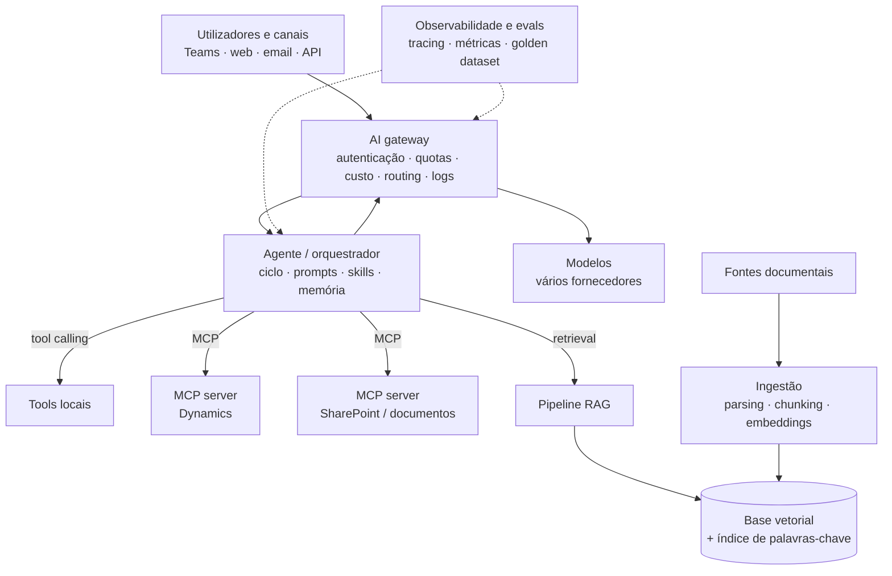
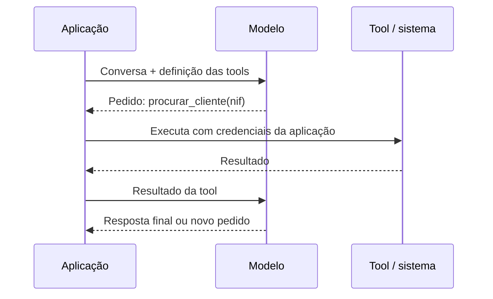
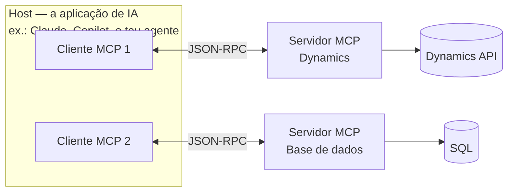
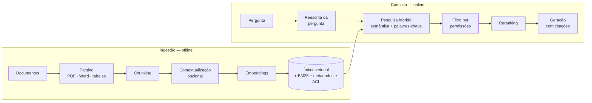
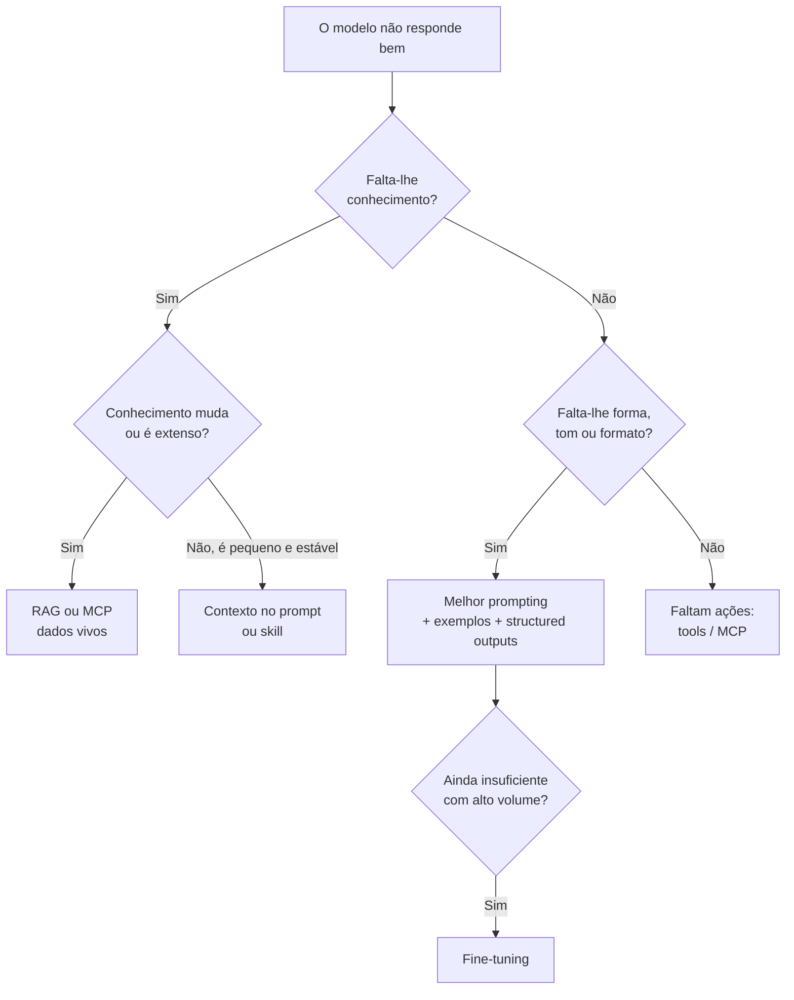

# Anexo A — Componentes e Técnicas da Arquitetura

> Workshop: Arquitetura AI em Ambiente Enterprise. Anexo de referência, transversal a todas as partes.

**Última atualização:** 2026-10-02

---

## Índice

1. [Mapa da arquitetura de referência](#1-mapa-da-arquitetura-de-referência)
2. [Tool calling e structured outputs](#2-tool-calling-e-structured-outputs)
3. [MCP — Model Context Protocol em profundidade](#3-mcp--model-context-protocol-em-profundidade)
4. [RAG — Retrieval Augmented Generation em profundidade](#4-rag--retrieval-augmented-generation-em-profundidade)
5. [Embeddings e bases vetoriais](#5-embeddings-e-bases-vetoriais)
6. [Engenharia de contexto: caching, compactação e skills](#6-engenharia-de-contexto-caching-compactação-e-skills)
7. [AI gateway](#7-ai-gateway)
8. [Prompting, RAG ou fine-tuning?](#8-prompting-rag-ou-fine-tuning)
9. [Matriz-resumo](#9-matriz-resumo)

---

## 1. Mapa da arquitetura de referência

Onde vive cada componente numa arquitetura enterprise de agentes.



---

## 2. Tool calling e structured outputs

### Tool calling (function calling)

É o mecanismo de base sobre o qual tudo o resto assenta, incluindo o MCP.

1. A aplicação envia ao modelo a conversa e a **lista de tools** (nome, descrição, JSON Schema dos parâmetros).
2. O modelo **não executa nada**: responde com um pedido estruturado — "chamar `procurar_cliente` com `{nif: "123456789"}`".
3. A aplicação executa a função, devolve o resultado ao modelo, e o ciclo continua.



**Ponto-chave de segurança:** quem executa é sempre o teu código, com as tuas regras. O modelo só propõe.

### Structured outputs

Obrigar o modelo a responder num formato garantido, validado contra um JSON Schema. Essencial quando a resposta vai alimentar outro sistema (ex.: extrair campos de uma fatura para o ERP). Elimina a fragilidade de "pedir JSON no prompt e esperar que venha bem".

---

## 3. MCP — Model Context Protocol em profundidade

### O que resolve

Sem MCP, cada combinação aplicação × sistema exige uma integração própria: **N × M integrações**. Com MCP, cada sistema expõe **um** servidor e cada aplicação implementa **um** cliente: **N + M**. É o "USB-C" dos agentes.

### Governança e adoção

Criado e publicado pela Anthropic em novembro de 2024, foi doado em dezembro de 2025 à **Agentic AI Foundation**, sob a Linux Foundation, ao lado do Goose (Block) e do AGENTS.md (OpenAI). Membros platinum incluem AWS, Anthropic, Block, Bloomberg, Cloudflare, Google, Microsoft e OpenAI. Está integrado no Claude, Microsoft Copilot, Gemini, ChatGPT e outras plataformas. Ou seja: é um padrão neutro, não um protocolo de um fornecedor.

### Arquitetura: três papéis



- **Host** — a aplicação onde vive o modelo; gere permissões e consentimento do utilizador.
- **Cliente** — dentro do host, mantém uma ligação 1:1 com um servidor.
- **Servidor** — programa que expõe capacidades de um sistema. Comunicação em **JSON-RPC 2.0**.

### Primitivas

| Lado | Primitiva | O que é | Quem controla | Exemplo |
|---|---|---|---|---|
| Servidor | **Tools** | Ações executáveis | O modelo decide quando chamar | `criar_oportunidade`, `consultar_fatura` |
| Servidor | **Resources** | Dados para leitura, identificados por URI | A aplicação decide o que anexar | Ficha de cliente, ficheiro, esquema de BD |
| Servidor | **Prompts** | Modelos de instruções reutilizáveis | O utilizador escolhe | "Resumo de conta de cliente" |
| Cliente | **Sampling** | O servidor pede ao modelo do host uma geração | Host, com aprovação | Servidor que precisa de classificar texto |
| Cliente | **Roots** | O cliente indica ao servidor que fronteiras pode usar | Host | Pastas ou projetos permitidos |
| Cliente | **Elicitation** | O servidor pede informação adicional ao utilizador | Utilizador | "Confirma o centro de custo?" |

### Transportes

- **stdio** — o servidor corre como processo local ao lado do host. Simples, ideal para ferramentas de desenvolvimento e uso pessoal.
- **Streamable HTTP** — o servidor corre remotamente como serviço web. É o modelo enterprise: centralizado, escalável, com autenticação.

### Autenticação

Para servidores remotos, a especificação assenta em **OAuth 2.1**: o cliente obtém um token em nome do utilizador, com âmbito limitado, e o servidor valida-o. Em enterprise liga-se ao IdP existente (ex.: Entra ID).

### Padrões enterprise

- **Servidores remotos centralizados** em vez de cada pessoa correr servidores locais.
- **MCP gateway** — ponto único à frente dos servidores: autenticação, autorização por ferramenta, rate limiting, auditoria, filtragem de respostas.
- **Registo interno de servidores aprovados**, com versões fixadas e revisão de segurança (ver Parte 3, ASI04).
- **Desenho das tools por tarefa**, não espelho da API (ver Parte 1, secção 5).
- **Permissões do utilizador propagadas**: o servidor do Dynamics só devolve o que o utilizador pode ver.

### Riscos específicos

- **Tool poisoning** — descrições de tools com instruções escondidas que manipulam o modelo.
- **Rug pull** — um servidor muda o comportamento depois de aprovado; daí fixar versões.
- **Excesso de tools** — dezenas de servidores ligados ao mesmo agente degradam a escolha e enchem o contexto.
- **Confused deputy** — o servidor usa as suas próprias credenciais amplas em vez das do utilizador.

---

## 4. RAG — Retrieval Augmented Generation em profundidade

### Pipeline completo



### Fase de ingestão

| Etapa | O que fazer | Erros comuns |
|---|---|---|
| **Parsing** | Extrair texto preservando estrutura: títulos, tabelas, listas | Tabelas achatadas em texto ilegível; PDFs digitalizados sem OCR |
| **Chunking** | Partir em pedaços com significado próprio | Cortes a meio de frases ou tabelas |
| **Metadados** | Fonte, data, autor, departamento, **permissões** | Esquecer as ACL — o agente passa a mostrar o que o utilizador não pode ver |
| **Embeddings** | Converter cada chunk num vetor | Mudar de modelo de embeddings sem reindexar tudo |

**Estratégias de chunking:**

- **Tamanho fixo com sobreposição** — simples; ponto de partida razoável.
- **Por estrutura** — segue títulos e secções do documento; melhor para manuais e políticas.
- **Semântico** — corta onde o tema muda.
- **Hierárquico (parent-child)** — pesquisa em pedaços pequenos e precisos, mas devolve ao modelo o bloco maior que os contém.

### Fase de consulta

- **Reescrita da pergunta** — transformar "e no ano passado?" numa pergunta autónoma; ou gerar várias variantes da pergunta.
- **Pesquisa híbrida** — vetorial (significado) + **BM25** (palavras exatas). Indispensável para NIFs, códigos de produto, referências de contrato e nomes próprios, onde a pesquisa semântica sozinha falha.
- **Filtro por metadados e permissões** — aplicado na pesquisa, não depois.
- **Reranking** — um modelo especializado reordena os ~50 candidatos e escolhe os ~5–20 mais relevantes. Grande ganho de qualidade por custo baixo.
- **Geração com citações** — o modelo responde só com base nos pedaços e cita a fonte, o que permite verificação e auditoria.

### Técnica de destaque: contextual retrieval

Proposta pela Anthropic. Antes de indexar, cada chunk recebe um pequeno texto de contexto gerado por um modelo (ex.: "Este excerto é da secção de penalizações do contrato com o fornecedor X, 2025"). Isto resolve o problema clássico de um chunk perder o sentido fora do documento. Resultados publicados, em falhas de recuperação:

| Técnica | Redução de falhas de recuperação |
|---|---|
| Contextual embeddings | 35% |
| + Contextual BM25 | 49% |
| + Reranking | 67% |

Com **prompt caching**, o custo de contextualizar um corpus grande fica baixo.

### Variantes avançadas

- **Agentic RAG** — o agente decide quando pesquisar, reformula e pesquisa de novo se o resultado não chega. Combina RAG com o ciclo de agente.
- **GraphRAG** — extrai entidades e relações para um grafo de conhecimento. Forte em perguntas que atravessam documentos ("que contratos têm fornecedores em comum com o projeto X?") e em resumos globais de um corpus. Mais caro de construir e manter.
- **Agentic search sem índice** — com janelas de contexto grandes, o agente pesquisa diretamente nas fontes com ferramentas de busca (ver Parte 1). Menos infraestrutura; bom ponto de partida.

### Avaliação de um sistema RAG

Avaliar separadamente as duas metades:

| Métrica | Mede | Metade |
|---|---|---|
| Context recall | Os pedaços certos foram encontrados? | Recuperação |
| Context precision | Os pedaços encontrados são relevantes? | Recuperação |
| Faithfulness | A resposta está suportada pelos pedaços, sem inventar? | Geração |
| Answer relevance | A resposta responde à pergunta? | Geração |

Frameworks como o RAGAS automatizam estas métricas. Quando a qualidade é má, quase sempre o problema está na **recuperação**, não no modelo.

---

## 5. Embeddings e bases vetoriais

**Embedding:** vetor numérico (centenas a milhares de dimensões) que representa o significado de um texto. Textos com significado parecido ficam próximos no espaço vetorial; a proximidade mede-se tipicamente por **similaridade de cosseno**.

**Escolha do modelo de embeddings:** qualidade no idioma (português!), domínio, dimensão do vetor (custo de armazenamento), e residência dos dados. Mudar de modelo obriga a reindexar tudo.

**Base vetorial:** armazena os vetores e faz pesquisa por vizinhos mais próximos aproximada (ANN, ex.: índices HNSW), com filtros por metadados.

| Opção | Tipo | Quando faz sentido |
|---|---|---|
| **pgvector** (PostgreSQL) | Extensão de BD relacional | Já tens PostgreSQL; volumes moderados; simplicidade operacional |
| **Azure AI Search** | Serviço gerido de pesquisa | Clientes Azure; pesquisa híbrida e reranking semântico integrados; segurança Entra |
| **Elasticsearch / OpenSearch** | Motor de pesquisa | Já existe na casa; pesquisa por palavras-chave forte |
| **Qdrant, Weaviate, Milvus** | Bases vetoriais dedicadas | Grandes volumes, open source, self-hosted possível |
| **Pinecone** | Serviço vetorial gerido | Rapidez de arranque, sem operar infraestrutura |

**Regra prática:** começar com o que a organização já opera; a base vetorial raramente é o gargalo de qualidade.

---

## 6. Engenharia de contexto: caching, compactação e skills

A janela de contexto é o recurso mais escasso de um agente. **Engenharia de contexto** é a disciplina de decidir o que entra, quando, e em que forma.

### Prompt caching

O fornecedor guarda o processamento da parte fixa e repetida do prompt (instruções, definição de tools, documentos de referência). Chamadas seguintes reutilizam-na com **menor custo e latência**. Regra de desenho: **conteúdo estável primeiro, conteúdo variável no fim**.

### Compactação

Em tarefas longas, resumir o histórico antigo, limpar resultados de tools já usados e manter notas de estado num ficheiro (ver Parte 1, secção 7).

### Agent Skills

Pacotes de conhecimento procedimental que o agente carrega **só quando precisa**. Seguem uma especificação aberta (agentskills.io), lançada pela Anthropic e adotada por outros, incluindo o Microsoft Agent Framework.

```
expense-report/
├── SKILL.md          # obrigatório: frontmatter (name, description) + instruções
├── scripts/          # código que o agente pode correr
├── references/       # documentos lidos a pedido
└── assets/           # templates e recursos
```

**Divulgação progressiva (progressive disclosure):**

| Etapa | O que entra no contexto | Custo |
|---|---|---|
| 1. Anunciar | Só nome e descrição de cada skill | ~100 tokens por skill |
| 2. Carregar | O corpo do SKILL.md, quando relevante | Recomendado < 5000 tokens |
| 3. Ler recursos | Ficheiros de referência, se necessário | A pedido |
| 4. Correr scripts | Executar código incluído | A pedido |

**Skills vs MCP:** o MCP dá **acesso** a sistemas (o quê); as skills dão **know-how** sobre como fazer uma tarefa (o como). Complementam-se: uma skill "fecho mensal" pode usar as tools do servidor MCP do ERP.

---

## 7. AI gateway

Camada à frente de todos os modelos, equivalente a um API gateway mas especializada em IA.

- **Autenticação e quotas** por equipa, aplicação ou agente (limites de tokens)
- **Gestão de custo** — atribuição de consumo por centro de custo
- **Routing e fallback** entre modelos e fornecedores; modelo como peça trocável
- **Caching**, incluindo caching semântico de perguntas equivalentes
- **Logging e auditoria** centralizados; ponto natural para guardrails e DLP
- **Residência de dados** — garantir que os pedidos vão para regiões permitidas

Exemplos: Azure API Management (capacidades de AI gateway), LiteLLM, Kong AI Gateway, Cloudflare AI Gateway.

---

## 8. Prompting, RAG ou fine-tuning?



| Técnica | Resolve | Não resolve | Custo |
|---|---|---|---|
| Prompting + exemplos | Comportamento, formato, tom | Conhecimento que o modelo não tem | Baixo |
| RAG | Conhecimento extenso, atualizado, citável | Raciocínio ou formato | Médio |
| MCP / tools | Dados vivos e ações em sistemas | Know-how de processo | Médio |
| Skills | Know-how procedimental reutilizável | Acesso a sistemas | Baixo |
| Fine-tuning | Estilo consistente, tarefas estreitas de alto volume | Conhecimento que muda; citação de fontes | Alto, e repete-se a cada novo modelo |

**Regra:** tentar por esta ordem — prompting → RAG/MCP/skills → fine-tuning. A maioria dos casos enterprise nunca precisa de fine-tuning.

---

## 9. Matriz-resumo

| Componente | O que é | Problema que resolve | Ponto crítico enterprise |
|---|---|---|---|
| Tool calling | Modelo propõe chamadas a funções; o código executa | Dar ações ao modelo | O código decide, não o modelo |
| Structured outputs | Resposta validada contra JSON Schema | Integração fiável com sistemas | Usar sempre que a saída alimenta outro sistema |
| MCP | Protocolo aberto agente ↔ sistemas (tools, resources, prompts) | N × M integrações → N + M | Servidores remotos, OAuth, gateway, registo aprovado |
| RAG | Recuperar pedaços relevantes e gerar com base neles | Conhecimento extenso e atualizado | Chunking, pesquisa híbrida, reranking, ACL |
| Contextual retrieval | Contexto acrescentado a cada chunk antes de indexar | Chunks sem sentido fora do documento | Até 67% menos falhas com reranking |
| GraphRAG | Grafo de entidades e relações | Perguntas entre documentos | Custo de construção e manutenção |
| Embeddings + base vetorial | Representação do significado e pesquisa por proximidade | Pesquisa semântica | Idioma, reindexação, usar o que já existe |
| Prompt caching | Reutilizar o processamento da parte fixa do prompt | Custo e latência | Estável primeiro, variável no fim |
| Agent Skills | Pacotes de know-how carregados a pedido | Conhecimento procedimental sem encher contexto | Divulgação progressiva; complementa MCP |
| AI gateway | Camada central à frente dos modelos | Custo, quotas, routing, auditoria | Ponto natural para guardrails e DLP |
| Fine-tuning | Treino adicional do modelo | Estilo e tarefas estreitas de alto volume | Último recurso |

### Fontes

- [Agentic AI Foundation (Campus Technology)](https://campustechnology.com/Articles/2025/12/15/Newly-Launched-Agentic-AI-Foundation-Brings-Together-Tech-Giants-for-Open-Source-AI-Development.aspx)
- [Anthropic's Contextual Retrieval (Maginative)](https://www.maginative.com/article/anthropics-contextual-retrieval-technique-enhances-rag-accuracy-by-67)
- [Agent Skills (Microsoft Agent Framework docs)](https://learn.microsoft.com/en-us/agent-framework/agents/skills)
